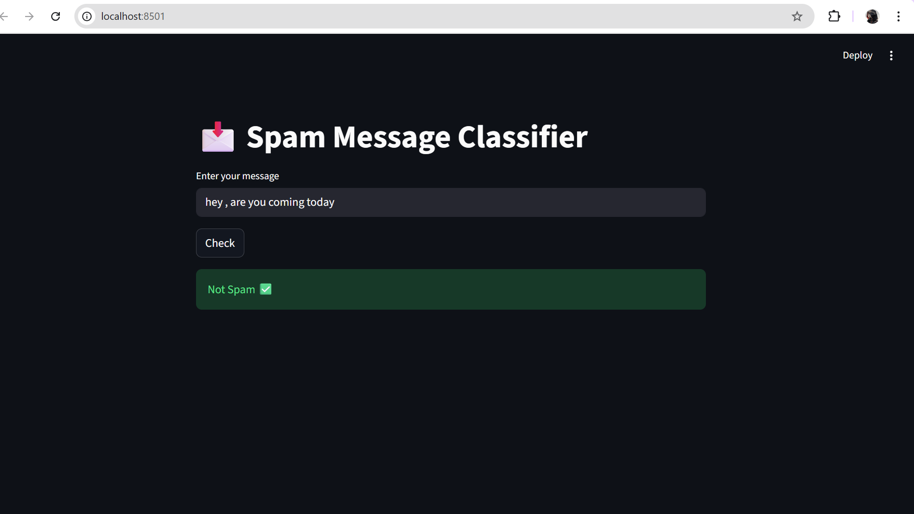

## Demo

# Spam Message Classifier

A machine learning web app that classifies messages as Spam or Not Spam.

## Tech Stack
- Python
- Pandas
- Scikit-learn
- Streamlit

## Features
- Text classification using Naive Bayes
- Accuracy ~98%
- Real-time prediction via web app

## How to Run
pip install pandas numpy scikit-learn streamlit
streamlit run app.py
